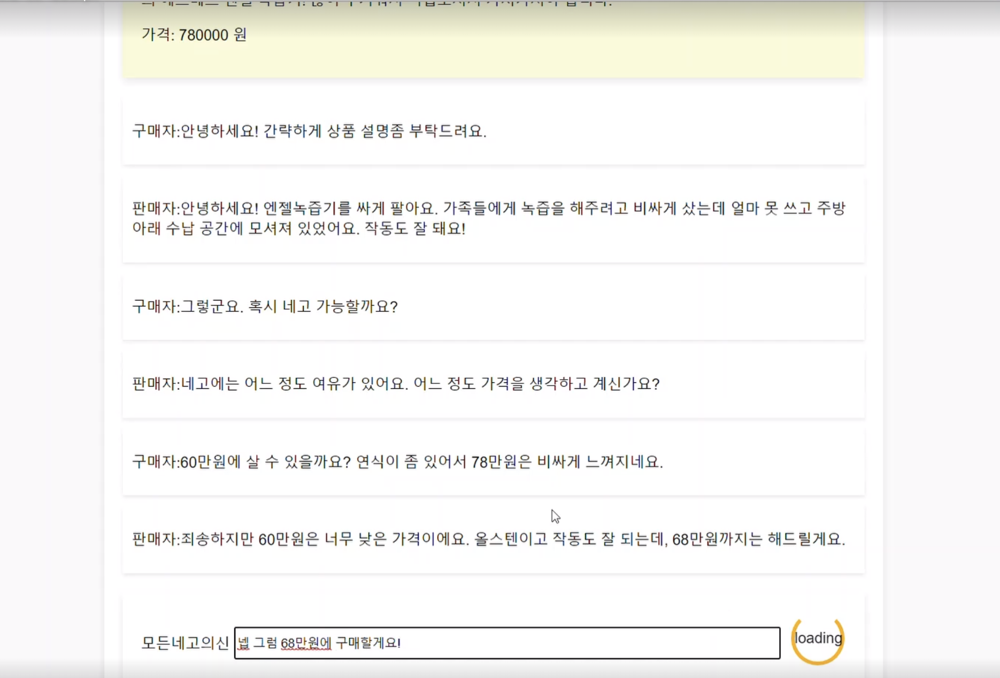
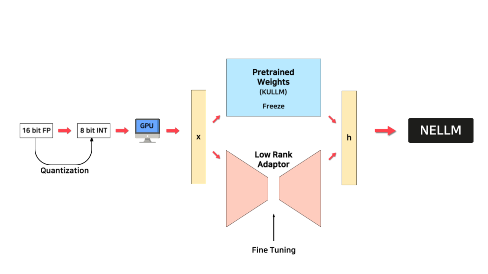
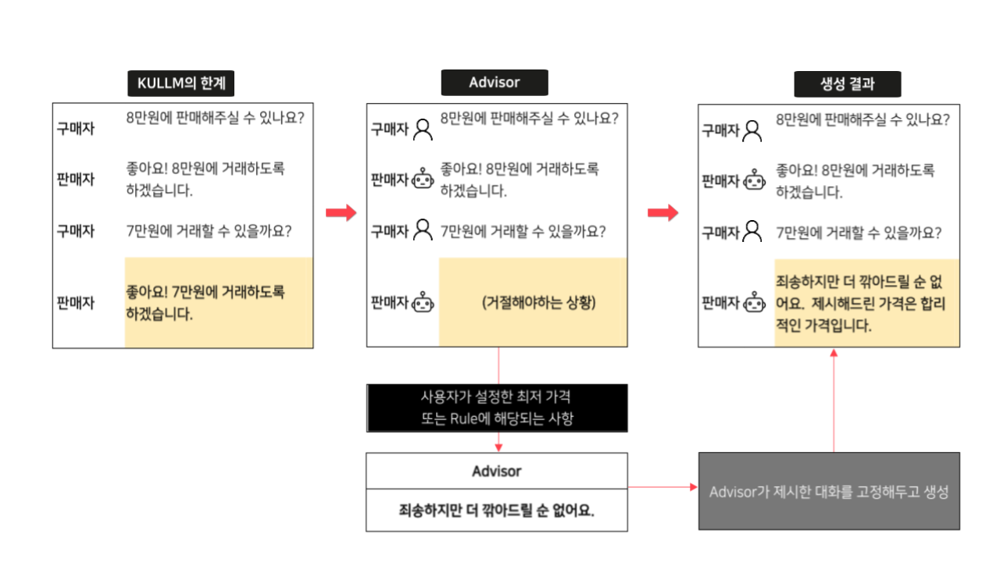
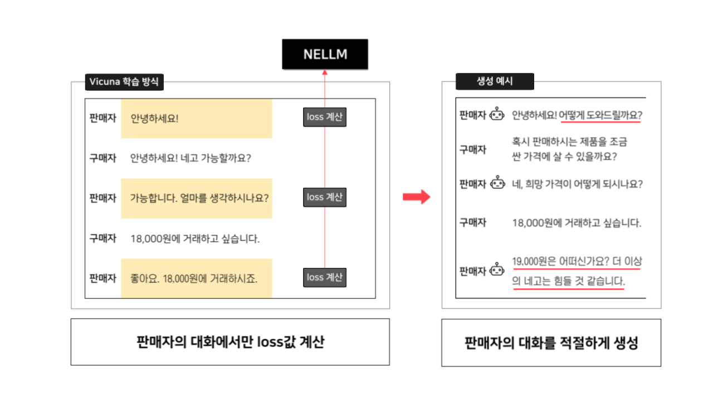
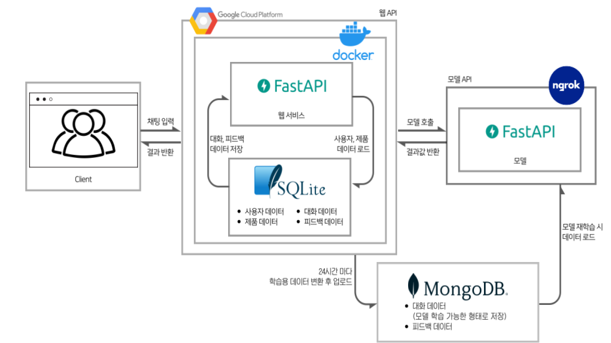

[](https://boostcamp.connect.or.kr/)

# :honey_pot:🐯:NELLM(낼름): NEgotiation Large Language Model
[](https://www.notion.so/boostcampait/NLP-03-NELLM-54aea5571d5f488f96cf8668fe5a8b80?pvs=4)
[](https://www.youtube.com/watch?v=66qdusEwjZw)
[](https://huggingface.co/ggul-tiger)

NELLM(낼름)은 중고거래에서 판매자 대신 가격을 협상에 1대 n으로 대응하는 챗봇 어플리케이션입니다.

# Demo & Example
<h3 align="center"><a href=http://nellm.site> http://nellm.site </a></h3>



- 배포 기간 : 23.07.19 21:00 ~ 23.08.18 16:00
- 배포 형태 : 많은 user들이 이용하여 데이터를 수집하기 위해 NELLM과 대화할 수 있는 게임 형태로 배포했습니다.
- 이용 방법 : `회원 등록`후 `판매 목록`에서 원하는 상품 페이지에 입장하여 NELLM과 대화할 수 있습니다.


# 🌱Members

|</img>|</img>|</img>|</img>|</img>|
| --- | --- | --- | --- | --- |
| [김민혁](https://github.com/torchtorchkimtorch) | [김의진](https://github.com/KimuGenie) | [김성우](https://github.com/tjddn0402) | [오원택](https://github.com/dnjdsxor21) | [정세연](https://github.com/jjsyeon) |
|Data|Model|Model|Service|Service|
|- Data 수집 · 번역<br>- ChatGPT API 활용 데이터 생성<br>- 데이터 전처리 · EDA|- QLoRA · Vicuna 학습 구현<br>- 모델 출력 조절 Advisor 제작<br>- 데이터 검수|- LoRA fine-tuning<br>- 데이터 검수|- Web API, Model API 서빙 및 관리<br>- 사용자 데이터, 로그 분석|- 데이터 파이프라인 자동화<br>- 사용자 데이터 분석 및 학습 데이터 제작|


# Model

🤗[NELLM(낼름)](https://huggingface.co/ggul-tiger)은 [KULLM(구름)](https://github.com/nlpai-lab/KULLM)을 바탕으로 QLoRA fine-tuning된 모델입니다.

## Key Features
1. [QLoRA fine-tuning](./chat_bot/scripts/train.py)  

fp16에서 int8로 quantizing한 후 LoRA(Low Rank Adaptation)을 적용하여 가용한 자원 (NVIDIA V100 VRAM 32GB) 내에서 학습이 가능하게 하였다.  
2. [Advisor](./chat_bot/neural_chat/advisor.py)  

가격을 regex로 추적하며 [rule을 기반](./chat_bot/neural_chat/price_parser.py)으로 NELLM의 발화를 일정부분 강제하여 control하였습니다.
3. [Vicuna Training](https://lmsys.org/blog/2023-03-30-vicuna/)  

[판매자의 발화만 학습하도록 데이터셋을 구축(./chat_bot/neural_chat/dataset/e2e_dataset.py)](./chat_bot/neural_chat/dataset/e2e_dataset.py)하여 모델이 구매자의 발화까지 혼동하여 함께 생성하는 현상을 방지했습니다.

# Dataset

🤗[NELLM 데이터셋 v1](https://huggingface.co/datasets/ggul-tiger/negobot_cleaned_100): ChatGPT로 자체 생성한 데이터셋  
🤗[NELLM 데이터셋 v2](https://huggingface.co/datasets/ggul-tiger/negobot_cleaned_361): v1 + 제목, 상품 설명, 가격 크롤링 후 채팅만 ChatGPT로 생성한 데이터셋  
🤗[NELLM 데이터셋 v3](https://huggingface.co/datasets/ggul-tiger/negobot_361_weakcase_injected): v2에 유저 로그에서 특이 케이스(예: 무료 나눔 해주세요.)에 대응하는 발화가 추가된 데이터셋  
🤗[유저 데이터셋](https://huggingface.co/datasets/ggul-tiger/negobot_userdata): 앱 배포 후 사용자로부터 얻어 정제한 데이터셋  

## Data Schema
```json
{
    "title":"{제목}",               // str
    "description":"{상품 정보}",    // str
    "price": "상품 가격",           // int
    "result":"ACCEPT 또는 DENY",    // str
    "events":[
        {"role":"구매자","message":"안녕하세요! 물건 팔렸나요?"},
        {"role":"판매자", "message":"아직 안팔렸습니다~"},
        //...
        {"role":"구매자","message":"##<{최종 제안 가격}>##"},
        {"role":"판매자", "message":"##<{수락/거절}>##"},
    ],
}
```
정의된 데이터는 다음과 같이 나누어진다. `events`의 길이가 데이터마다 다르기 때문에 json-like data로 정의하였다.
- `title`: str
    - 중고거래 판매글 제목
- `description`: str
    - 중고거래 판매글 내용
- `price`: int
    - 판매자가 올린 가격
- `result`: str
    - 거래가 성사되었는지 여부를 의미한다. `"##<수락>##"` 또는 `"##<거절>##"`이다.
- `events`: List[Dict]
    - `role`과 `message`를 key 값으로 가지는 dictionary들을 원소로 가지고, 대화 턴의 길이는 데이터마다 다르다.

## Synthetic Data Generation


기존 영어 데이터셋인 [CraigslistBargain](https://github.com/stanfordnlp/cocoa)를 번역하여 사용했으나, 단순한 대화패턴, 번역체, 문화 차이에 따른 부적절한 내용 등의 한계를 극복하고자 ChatGPT API를 이용해 데이터를 직접 생성했다.
### [Prompt Rules](./dataprincess.ipynb)
1. 국내 중고거래 플랫폼에서 사용되는 용어 반영 (ex. 네고, 쿨거래 등)
2. 대화 패턴 다양화 
    - 구매자의 페르소나 부여
    - 그에 따른 판매자의 반응
    - 가격 제안의 근거로 상품 설명 활용
3. 거래가 성사(ACCEPT)되기만 하는 데이터 편중을 막기 위해 30% 확률로 거절(DENY)하는 데이터를 생성하도록 prompt 구성

# Web



- Frontend : HTML5
- Backend : FastAPI
- App server : GCP (Google Cloud Platform)
- Model Server : Upstage에서 제공받은 V100 서버
- DB : 채팅 데이터는 App Server의 SQLite(Relational DB)에 저장되며, 24시간마다 한 번씩 json 형태의 data를 가져오기 위해 MongoDB로 옮겨진다.


# Environment
- Ubuntu 18.04.6 LTS
- NVIDIA Volta V100 VRAM 32GB
- Python>=3.9
- Poetry & Pyenv 가상환경 설정  
    poetry가 설치되어 있는지 확인 후, 설치되어있지 않다면 [설치](https://python-poetry.org/docs/#installation)한다.
    ```bash
    curl -sSL https://install.python-poetry.org | python3 -
    ```
    이 repo를 clone 한다.
    ```bash
    git clone https://github.com/boostcampaitech5/level3_nlp_finalproject-nlp-03
    cd level3_nlp_finalproject-nlp-03
    poetry install
    ```
- [Web server 환경 설정](./app/README.md)

# How to run

## Model train & evaluation
### 1. LoRA fine-tuning
```bash
> python chat_bot/scripts/train.py --help

usage: train.py [-h] [--train-dataset-names TRAIN_DATASET_NAMES [TRAIN_DATASET_NAMES ...]] [--model-name-or-checkpoint MODEL_NAME_OR_CHECKPOINT] [--dataset-type DATASET_TYPE] [--conv-template CONV_TEMPLATE] [--max-length MAX_LENGTH] [--epoch EPOCH]
                        [--max-steps MAX_STEPS] [--batch-size BATCH_SIZE] [--grad-accum GRAD_ACCUM] [--lr LR] [--output-dir OUTPUT_DIR] [--run-name RUN_NAME] [--peft-type PEFT_TYPE] [--lora-r LORA_R] [--lora-alpha LORA_ALPHA] [--lora-dropout LORA_DROPOUT]
                        [--n_virtual_token N_VIRTUAL_TOKEN]

optional arguments:
  -h, --help            show this help message and exit
  --train-dataset-names TRAIN_DATASET_NAMES [TRAIN_DATASET_NAMES ...]
                        list of dataset names. use as --train-dataset-names ds1 ds2
  --model-name-or-checkpoint MODEL_NAME_OR_CHECKPOINT
  --dataset-type DATASET_TYPE
  --conv-template CONV_TEMPLATE
  --max-length MAX_LENGTH
  --epoch EPOCH
  --max-steps MAX_STEPS
  --batch-size BATCH_SIZE
  --grad-accum GRAD_ACCUM
  --lr LR
  --output-dir OUTPUT_DIR
  --run-name RUN_NAME
  --peft-type PEFT_TYPE
  --lora-r LORA_R
  --lora-alpha LORA_ALPHA
  --lora-dropout LORA_DROPOUT
  --n_virtual_token N_VIRTUAL_TOKEN
```
- 실행 예시
```bash
python chat_bot/scripts/train.py \
    --train-dataset-names ggul-tiger/{dataset_name_1} ggul-tiger/{dataset_name_2}
```

### 2. evaluation
```bash
> python chat_bot/scripts/eval.py --help

usage: eval.py [-h] --data-path DATA_PATH --model_checkpoint_path MODEL_CHECKPOINT_PATH [--conv-template-name CONV_TEMPLATE_NAME] [--num-rollouts NUM_ROLLOUTS]

optional arguments:
  -h, --help            show this help message and exit
  --data-path DATA_PATH
  --model_checkpoint_path MODEL_CHECKPOINT_PATH
  --conv-template-name CONV_TEMPLATE_NAME
  --num-rollouts NUM_ROLLOUTS
```
- 실행 예시
```bash
python chat_bot/scripts/eval.py \
    --data-path ./data/sample_data.json \
    --model_checkpoint_path ggul-tiger/{model_name}
```

## Web server
### 1. WebAPI: NELLM의 프론트 & 백엔드를 구성하는 API
```bash
cd app
uvicorn main:app --port 80
```
### 2. ModelAPI: 구매자의 채팅을 입력 받아 적절한 대답을 출력하는 API
```bash
cd modelapi
uvicorn main:app --port 30007       
```

# References
- Verma, Siddharth, et al. “CHAI: A CHatbot AI for Task-Oriented Dialogue with Offline Reinforcement Learning.” Proceedings of the 2022 Conference of the North American Chapter of the Association for Computational Linguistics (NAACL), 2022.
- Lab, NLP &. AI, and Human-Inspired AI research. KULLM: Korea University Large Language Model Project. GitHub, 2023, https://github.com/nlpai-lab/kullm.
- He, He, et al. “Decoupling Strategy and Generation in Negotiation Dialogues.” CoRR, vol. abs/1808.09637, 2018, http://arxiv.org/abs/1808.09637.
- Ko, Hyunwoong, et al. A Technical Report for Polyglot-Ko: Open-Source Large-Scale Korean Language Models. 2023.
- Dettmers, Tim, et al. "Qlora: Efficient finetuning of quantized llms." arXiv preprint arXiv:2305.14314 (2023).
- @misc{zheng2023judging,
      title={Judging LLM-as-a-judge with MT-Bench and Chatbot Arena},
      author={Lianmin Zheng and Wei-Lin Chiang and Ying Sheng and Siyuan Zhuang and Zhanghao Wu and Yonghao Zhuang and Zi Lin and Zhuohan Li and Dacheng Li and Eric. P Xing and Hao Zhang and Joseph E. Gonzalez and Ion Stoica},
      year={2023},
      eprint={2306.05685},
      archivePrefix={arXiv},
      primaryClass={cs.CL}
}
